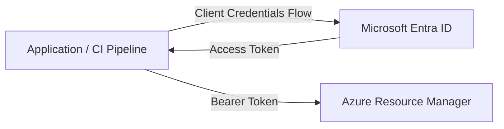
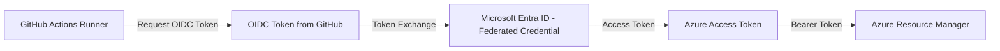
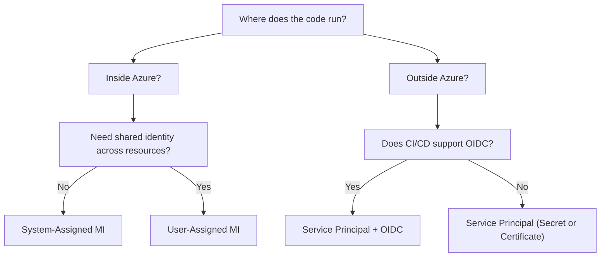

# 🔐 Azure Authentication Patterns


Comparative analysis and runnable examples of authentication mechanisms used in Azure workloads and CI/CD pipelines.

---

## 📌 Overview

This repository explains and compares the most common authentication models used in Azure:

- System-Assigned Managed Identity (SAMI)
- User-Assigned Managed Identity (UAMI)
- Service Principal with Client Secret
- Service Principal with OIDC Federation (GitHub Actions)

---

## 🎯 Purpose

This repository provides:

- Clear architectural comparison
- Minimal runnable examples
- Security-focused guidance
- Practical CI/CD integration patterns

---

# 🧠 1️⃣ System-Assigned Managed Identity (SAMI)

## When to use

- Workloads running inside Azure
- VM automation scripts
- Azure Functions
- App Services
- Internal service-to-service communication

## Key Characteristics

- Identity tied to a single Azure resource
- No credential management
- Token retrieved from IMDS endpoint
- Automatically deleted with the resource

## Authentication Flow

```mermaid
flowchart LR
    A["Azure VM - System Assigned MI"]
    B["IMDS (169.254.169.254)"]
    C["Microsoft Entra ID"]
    D["Azure Resource Manager"]

    A -->|Request Token| B
    B -->|OAuth2| C
    C -->|Access Token| A
    A -->|Bearer Token| D
````

---

# 🧠 2️⃣ User-Assigned Managed Identity (UAMI)

## When to use

* Multiple Azure resources share the same identity
* Separation of compute and identity lifecycle
* Controlled identity reuse

## Key Characteristics

* Identity independent from resource lifecycle
* Can be attached to multiple Azure resources
* Can be explicitly selected via `client_id`
* Requires RBAC assignment

## Authentication Flow

```mermaid
flowchart LR
    A["Azure VM - User Assigned MI"]
    B["IMDS"]
    C["Microsoft Entra ID"]
    D["Azure Resource Manager"]

    A -->|Request Token -client_id optional| B
    B -->|OAuth2| C
    C -->|Access Token| A
    A -->|Bearer Token| D
```

---

# 🧠 3️⃣ Service Principal + Client Secret (Classic)

## When to use

* External applications
* Legacy CI/CD systems
* Environments without OIDC support

## Key Characteristics

* Requires secret management
* Secret expiration and rotation required
* Uses OAuth2 Client Credentials Flow

## Authentication Flow



---

# 🧠 4️⃣ Service Principal + OIDC Federation (Modern CI/CD)

## When to use

* GitHub Actions
* Azure DevOps (OIDC)
* CI/CD systems supporting OpenID Connect

## Key Characteristics

* No stored secrets
* Token exchange model
* Federated identity configuration
* Short-lived tokens
* Recommended modern pattern

## Authentication Flow



---

# 📊 Comparison Table

| Feature                    | SAMI | UAMI | SP + Secret | SP + OIDC |
| -------------------------- | ---- | ---- | ----------- | --------- |
| Runs inside Azure only     | ✔    | ✔    | ❌           | ❌         |
| Requires secret            | ❌    | ❌    | ✔           | ❌         |
| Credential rotation needed | ❌    | ❌    | ✔           | ❌         |
| Reusable across resources  | ❌    | ✔    | ✔           | ✔         |
| Recommended for CI/CD      | ❌    | ❌    | ⚠️ Legacy   | ✔         |
| Security level             | High | High | Medium      | Very High |

---

# 🔎 Token Source Comparison

| Model             | Token Source                          |
| ----------------- | ------------------------------------- |
| Managed Identity  | IMDS endpoint                         |
| Service Principal | Azure AD OAuth2 endpoint              |
| OIDC Federation   | Federated token exchange via Azure AD |

---

# 🛡 Security Considerations

## Managed Identity

* Eliminates secret exposure
* Ideal for Azure-hosted workloads
* Minimal attack surface

## Service Principal + Secret

* Secret leakage risk
* Requires rotation policy
* Avoid when OIDC is available

## OIDC Federation

* No static credentials
* Strong identity binding
* Short-lived tokens
* Modern best practice

---

# 🎯 Best Practice Recommendations

| Scenario                        | Recommended Model               |
| ------------------------------- | ------------------------------- |
| Azure VM automation             | Managed Identity                |
| Shared identity across services | User-Assigned MI                |
| GitHub → Azure deployment       | OIDC Federation                 |
| Legacy system integration       | Service Principal + Certificate |

---

## ✅ Decision Tree: Which model should I choose?



---

# 📚 Practical Examples

This repository includes runnable examples in the `examples/` folder:

* VM script using Managed Identity
* VM script using User-Assigned Managed Identity
* Service Principal login with client secret
* GitHub Actions workflow using OIDC

See `examples/README.md` for details.

---

# 🧠 Key Insight

Managed Identity is technically a Service Principal managed automatically by Azure.

OIDC Federation is also based on a Service Principal — but replaces static credentials with secure token exchange.

---

# 👤 About This Repository

This project serves as a practical identity architecture lab for Azure automation and CI/CD scenarios.


